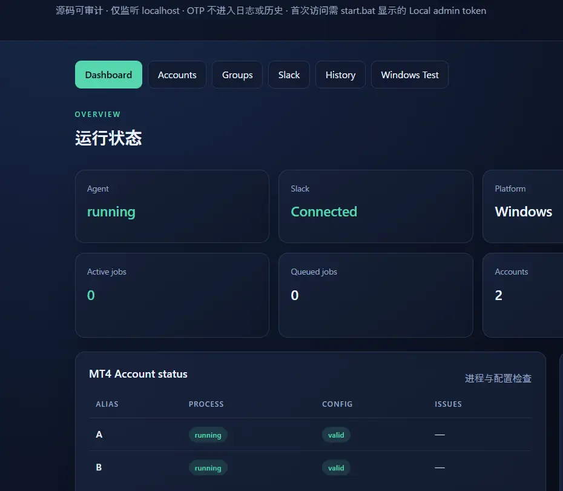
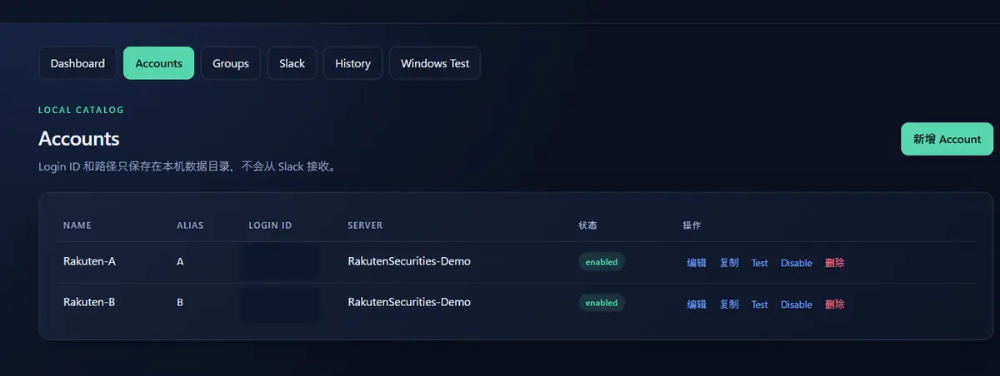
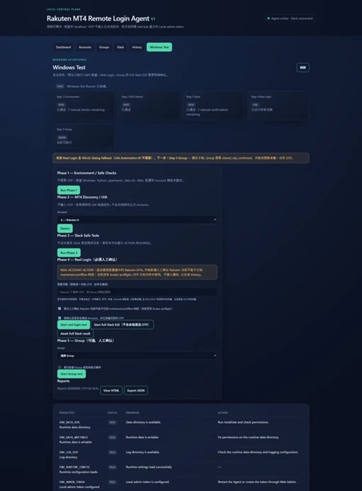
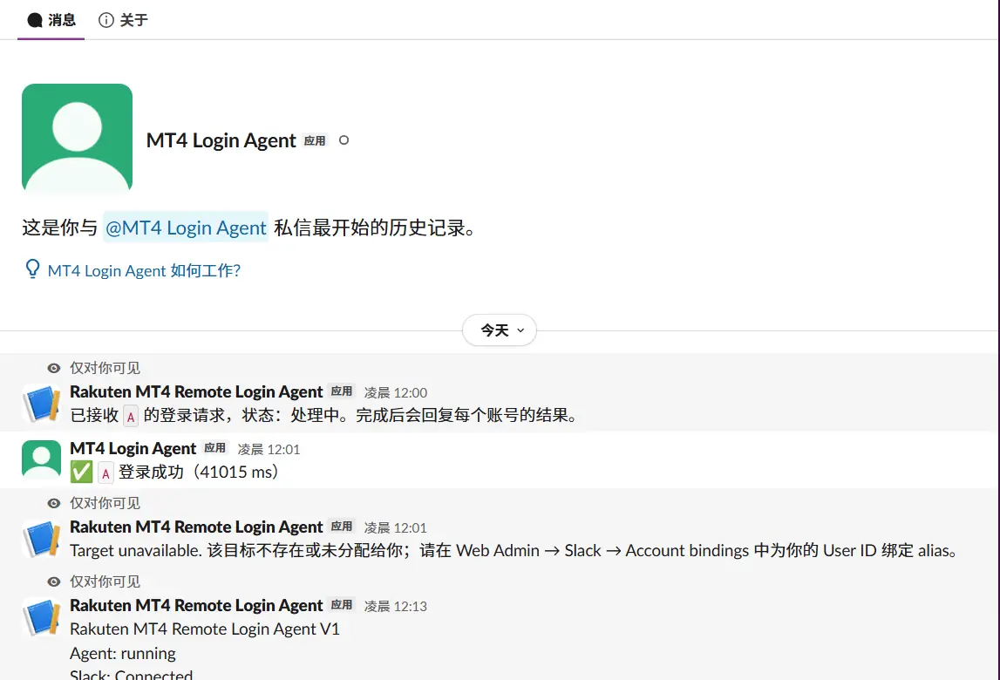

# MT4 リモートログイン Agent

[简体中文](README.md) | [日本語](README.ja.md) | [English](README.en.md)

ソースが監査可能な MetaTrader 4 リモートログイン Agent です。**你自己的 Windows
PC 上で**動作します。

本の同事が Slack で 1 コマンドを送ります:

```text
/mt4 A 123456
```

`A` はローカル Web Admin で設定した **Account エイリアス**であり、実際の Login ID では
ありません。`123456` はその 1 回限りの**クレデンシャル**(パスワードまたはワンタイム
コード)です。Agent は自分の PC 上の該当 MT4 ターミナルを探し、保存済みの Login ID と
Server と合わせてログインし、**結果を要求した人にだけ返信します**。

Agent は自分のマシン上で動きます。公開サーバーも、受信ポートも、データベースも不要です。

> ### ⚠️ 先に読んでください
>
> **本プロジェクトは Rakuten の公式製品ではなく、Rakuten との提携・スポンサーシップ・
> 推奨はまったくありません。** 文中の「Rakuten MT4」は、実機で検証済みの
> ブローカー / MT4 ビルドの**例**としてのみ登場します。ブローカー固有の設定(ダイアログ
> のコントロール ID、メニュー文言、ウィンドウタイトル)はすべてブローカーに依存します。
> [新しいブローカーへの対応](#9-新しいブローカーへの対応)を参照してください。
>
> **検証状況の正直な説明**: MT4 自動化の中核(Win32 ログインダイアログの一連の操作、
> 複数ターミナルの分離、ログイン成功の判定、ダイアログの自動オープン)は
> **実 Windows + 実ブローカターミナルで検証済み**です。一方、Slack 経由の完全な
> エンドツーエンド往復、グループログイン、そして比較的新しい Win32 Inspector は
> **未検証**です。実機が必要で未検証の項目は `WINDOWS_REAL_TEST_REQUIRED` を返し、
> **合格を偽装することはありません**。項目ごとの境界は
> [既知の制約](#11-既知の制約)にあります。

## 目次

- [できること](#2-できること)
- [クイックスタート](#3-クイックスタート)
- [Slack コマンドと権限制御](#4-slack-コマンドと権限制御)
- [複数アカウントと複数ターミナル](#5-複数アカウントと複数ターミナル)
- [Windows Test](#6-windows-test)
- [Win32 Inspector](#7-win32-inspector)
- [新しいブローカーへの対応](#9-新しいブローカーへの対応)
- [セキュリティモデル](#10-セキュリティモデル)
- [既知の制約](#11-既知の制約)
- [ドキュメント一覧](#12-ドキュメント一覧)
- [スクリーンショット](#13-スクリーンショット)
- [開発](#14-開発)
- [データとファイル](#15-データとファイル)
- [停止・更新・アンインストール](#16-停止更新アンインストール)
- [ライセンス](#17-ライセンス)

## 1. プロジェクトの範囲

**解決する問題**: MT4 のワンタイムコードは有効期限が短く、PC から離れているとログインを
完了できません。Slack が「アカウントエイリアス + クレデンシャル」を Agent に届け、
Agent は**あなたの** MT4 ログインフォームに入力して結果を返します。

**何ではないか**:

- 取引ツールではない — 発注せず、ポジションに触れ、残高も読みません
- クラウドサービスではない — サーバー側も、アカウント体系もありません
- どのブローカーの公式クライアントでもない

**境界**: Agent は自分のマシンで「フォームへの入力 + ログインボタンのクリック」を
1 回行うだけで、あとは MT4 に委ねます。

## 2. できること

| 機能 | 備考 |
|---|---|
| Slack コマンドでローカル MT4 にログイン | Socket Mode により **受信ポートは不要** |
| **複数アカウント**(1 人でも複数人でも) | それぞれ固有のエイリアス・インストールフォルダ・作業ディレクトリ |
| **Account 複製** | 同一ブローカー・同一ビルドの 2 つ目のアカウント用に設定済み項目をそのまま複製 |
| **ログインダイアログの自動オープン** | ターミナルの **メニューコマンド自体**を操作。座標も、順序を仮定したキー入力も使わない |
| **UIA 優先 + Win32 フォールバック** | ビルドが UIA を公開していれば UIA、していない場合はネイティブ Win32 のコントロール ID |
| **Win32 Inspector** | 対象マシンのログインダイアログを読み取り、設定を**提案**する(コントロール ID の手書きが不要に) |
| **Windows Test** | 段階式的・誘導式の受け入れ実行。**検証していないことを主張しない** |
| **History** | 誰が・いつ・何を要求し、結果はどうだったか。**クレデンシャルは含まれない** |
| **ユーザーごとの Account 紐付け** | 同じワークスペースでも、操作できるのは自分 に紐付けられたエイリアスだけ |
| **結果の秘匿配送** | 完了結果は要求者にのみ届く。**チャンネルには出ない** |

## 3. クイックスタート

1. **プロジェクトフォルダを** Windows PC にコピーします。
2. **Python 3.12**(推奨)または 3.11 と、Python Launcher `py.exe` を入れます。
3. [`install.bat`](install.bat) を実行します。依存関係を導入し、自己診断します。
4. [`start.bat`](start.bat) を実行し、表示される **ローカル admin token** を控えます。
5. ブラウザで `http://127.0.0.1:8765` を開き、トークンを入力します。ポート使用中なら
   コンソールが案内するので、`settings.json` を変更するか `--port` を使ってください。
6. **Accounts** でアカウントを追加します。`A` のような `alias` を付けます ——
   これが Slack で使う名前であり、実際の Login ID ではありません。ターミナルパスと
   プロセスの作業ディレクトリを入力します。
7. **Slack** ページで [`slack-app-manifest.yaml`](slack-app-manifest.yaml) から App を
   作成し、`xapp-` の app-level トークン、`xoxb-` の bot トークン、自分の Slack Member ID
   を貼り付けて保存します。
8. Slack で送信します:

   ```text
   /mt4 A 123456
   /mt4 status
   ```

Slack 側の詳細(App Home の Messages タブ、2 つのトークンの違い)は
**[docs/SLACK-SETUP.md](docs/SLACK-SETUP.md)** にあります。

## 4. Slack コマンドと権限制御

```text
/mt4 <alias-or-group> <credential>
/mt4 status
```

- `<alias-or-group>` は **Account エイリアス**(または Group 名)です。識別子であり、
  **Login ID ではありません**。
- `<credential>` には **パスワードまたはワンタイムコードだけ**を入れてください。
  **Login ID は含めないでください** —— Agent は Account からすでに知っています。

クレデンシャルは**不透明**です。空白や記号を含みます。Agent は最初のトークンの後ろの
すべてをクレデンシャルとして扱うため、空白を含むパスワードも機能します。

```text
/mt4 A hunter2correct-horse
/mt4 B 483920
```

### 独立した 2 つのゲート

1. **Allowed Slack User IDs** —— Agent を使える人そのもの。
2. **Account 紐付け** —— その人たちがチェックした Account エイリアス。

2 つ目は **fail-closed** です。allowlist にいても**紐付けが 1 つもなければ、操作できる
ものは何ひとつありません**。allowlist に人を追加しても既存アカウント全体へのアクセスが
暗黙に付与されることはないため、同僚を追加しても自分の口座が渡りません。

2 人の例:

```
U_A -> [A]
U_B -> [B]
```

**権限のないエイリアスと、そもそも存在しないエイリアスは、完全に同じ返信を返します。**
返信文言が違っては、どのエイリアスが存在するかを当てられてしまいます。
拒否されたリクエストはキューに入る前、MT4 に触れる前、クレデンシャルを
どこにも書く前に遮断されるため、ワンタイムコードを消費することも、ログイン枠を
占有することもありません。

| メッセージ | チャンネル内 | DM 内 | 見える人 |
|---|---|---|---|
| 即時 ack | 要求者のみ | 要求者のみ | 他人には見えない |
| 完了結果 | 要求者のみ(ephemeral) | 要求者のみ | 他人には見えない |
| `/mt4 status` | 要求者のみ | 要求者のみ | 他人には見えない |

`/mt4 status` は**呼び出し本人に紐付けられたエイリアスだけ**を表示します。全体アカウント
数、キュー深度、実行中ジョブ数は表示しません —— それらは他人の仕事についての数値です。

> 同じワークスペースの 2 人は、**Slack のメンバー一覧で互いのプロフィールを引き続き
> 見られます**。これは Slack 側の挙動であり、Agent が隠せるものでも隠そうとするものでも
> ありません。Agent が保証するのは、互いの MT4 Account が見えないこと、相手へのログインを
> 開始できないこと、相手のログイン結果を読めないことです。

## 5. 複数アカウントと複数ターミナル

MetaTrader 公式の推奨は、**複数のターミナルを同時に動かす場合はそれぞれ別のフォルダに
インストールする**ということです。Agent も同じ前提に依存します。
`terminal_path` と**プロセスの作業ディレクトリ**でターミナルを区別します。

- 同時に動かす各ターミナルは**専用のインストールフォルダ**を持つ
- 各 Account は固有の `terminal_path` と固有の `profile_path` を持つ
  (`profile_path` は**プロセスの作業ディレクトリ**であり、MT4 の Open Data Folder では
  **ありません**)

**インスタンス衝突ガード**: 有効化された 2 つの Account が同じターミナルインスタンスに
解決することは許されません。操作しようとすると理由付きで拒否され、自分のログインが
他人と衝突することはありません。無効のドラフトは準備中に source とパスを共有できます。

## 6. Windows Test

Web Admin 内の段階式的・誘導式の受け入れ実行です。**観察していないことを主張しません**。
アンカー付き成功式に一致するウィンドウを実際に確認して初めて、ログイン成功を報告します。

Step カードの意味:

| カード | 意味 |
|---|---|
| `FAIL` | 進行を妨げる失敗がある |
| `WARN` | 実際の警告や劣化があるが、フローは続行できる |
| `PASS` / `READY` | 自動チェックはすべて通過 |
| `MANUAL` 行 | 人が判断すべき事項(破壊的テスト、または手動でしか完了できない確認) |

**`MANUAL` がカードを黄色にすることはありません。** 該当項目は補助文の件数としてのみ
表示されます(`合格 · 2 件の_MANUAL_チェックが残っています`)。
**ある Step で何が起きたかを知るには、カードの色ではなく表を見てください。**

破壊的テスト(システム時刻の変更、UAC の発動、worker の kill、2 インスタンス)は任意扱いで、
**自動実行されることはありません**。

空のマシンから受け入れまでの完全な手順は
**[docs/WINDOWS-TEST-GUIDE.md](docs/WINDOWS-TEST-GUIDE.md)** にあります。

## 7. Win32 Inspector

**使う場面**: 新しいブローカー、または同一ブローカーの新しい MT4 ビルド。
**使わない場面**: 同一ブローカー・同一ビルドの 2 つ目のアカウント ——
その場合は **Account 複製**のほうが速いです。

```
Account 新規  →  その MT4 を起動  →  Windows Test: Detect Win32
             →  提案を確認  →  Apply  →  title 提案 2 件を手動でコピー
             →  Real Login で検証
```

| 特性 | 備考 |
|---|---|
| メタデータのみ | コントロール ID・クラス名・編集不可コントロールの文言を読みます。**Edit の値は決して読みません**。したがって Login ID、Server、クレデンシャルが漏れることはありません |
| 自動保存しない | Apply を押したときだけ書き込みます |
| 推測しない | 一意に決められない項目は `NEEDS_CONFIRMATION` として**値を提示しません**。必須項目に 1 つでも未確定があれば Apply は現れません |
| Win32 fallback のみ書き込み | `alias` / `login_id` / `server` / `terminal_path` / `profile_path` には一切触れません |
| 実際のメニュー文言を表示 | そのビルドが実際に持つメニュー文言がパネルに出ます。auto-open 失敗時の最速の原因究明手段です |

詳細は [docs/NEW-MT4-ADAPTER.md](docs/NEW-MT4-ADAPTER.md) にあります。

## 8. バージョン変更でも保たれる項目

| 安定 | 理由 |
|---|---|
| `terminal_path`、`profile_path`、`process_name` | ソフトウェアを再インストールまたは移動したときだけ変わります |
| `dialog_class` = `#32770` | Windows 標準のダイアログクラスで、どの MT4 ビルドでも同じです |
| Win32 の 6 つのコントロール ID | 数値の `DlgCtrlID` であり、**UI 言語では変わりません** |

| 壊れやすい | 理由 |
|---|---|
| `window_title_regex` | 多くの場合、ブローカーのブランド名と製品名を含みます |
| `success_window_title_regex` | アンカーが必要で、狭く書きがちです |
| UIA の `control_ids` | UIA プロバイダ依存で、ビルド間で保証されない。**ビルドによっては UIA を全く公開しない** |
| Win32 の `anchors` | 可視文言なので、言語やブランドで変わります |
| メニュー caption 一覧 | コード上の定数です。カスタムビルドの文言は異なる可能性があります |

**実用上の帰結**: あるビルドで UIA が使えていて、更新後に使えなくなった場合、それは
**既知であり想定される失敗**であって Agent のバグではありません。

## 9. 新しいブローカーへの対応

```
ブローカーの MT4 を導入して手動で 1 回ログイン  →  Account を作成
  (セレクタは空のまま)  →  そのターミナルを起動  →  Detect Win32
  →  確認  →  Apply  →  title 提案 2 件をコピー  →  Step 4 Real Login
```

**UIA がまったく利用できない場合、automation ID を手で入力しないでください** ——
そのビルドのログインフォームは UIA から全く見えないため、何を入力しても一致しません。
Win32 Inspector を使ってください。

完全な手順、項目の安定性の表、失敗モードは
**[docs/NEW-MT4-ADAPTER.md](docs/NEW-MT4-ADAPTER.md)** にあります。

## 10. セキュリティモデル

クレデンシャルは Slack からメモリへ、ログインフォームへと入り、**そこで終わります**。

以下には**現れません**: どのレベルのログ、History(`history.jsonl`)、レポート
(`report.json` / `report.html` / サニタイズ済み UIA ツリー)、設定ファイル、一時ファイル、
コマンドライン引数(したがってプロセス一覧にも表示されません)。

これを支える 3 つの仕組み:

1. **構造的** —— クレデンシャルをメッセージに整形するコード経路は存在しません。
   エラーは固定の理由だけを持ちます。
2. **登録** —— クレデンシャルは操作のあいだ live secret として登録され、描画される
   すべての値がそれに対して除去されます。
3. **パターン** —— `otp=` や `password:` などの断片を除去し、`/mt4` コマンドの残り
   全体を丸ごと除去します。

Web Admin は **loopback のみ**にバインドされ、書き込み系リクエストはすべて admin
トークンを要します。

**正直に，记す制約**: 値ベースのまま除去は 4 文字未満の候補を無視します。非常に短い
文字列は通常の文章に偶然頻出するため、置換すると出力が壊れるからです。短い
クレデンシャルは前 2 層に依存します。この下限を下げるのは正しい不及时であり、正解は
値をメッセージに一切入れないことであり、それはまさに 1 層目が保証していることです。

完全な脅威モデルは **[SECURITY.md](SECURITY.md)** にあります。

## 11. 既知の制約

ustsねAbility いは正直に列挙します。自分 undo を実際より大きく写着する公開プロジェクトは、
そうしないプロジェクトより害が大きいためです。

| 制約 | 影響 |
|---|---|
| **Windows 専用の自動化** | 他のプラットフォームでは明示的にマークされた mock が動き、**実ログインを静かに偽装しません** |
| **Slack のメンバー一覧** | 同僚は互いの Slack プロフィールを引き続き見られます。Agent の分離は Slack 自体の画面には及びません |
| **全ビルドが UIA を公開するわけではない** | 一部の MT4 ビルドはログインフォームを UI Automation に全く公開しません。Win32 フォールバックはそのためだけにあり、Account ごとのオプトインです |
| **auto-open はメニュー文言に依存** | 認識できるのは少数の標準 caption のみ。カスタムビルドではダイアログを手動で開く必要があり、他の手順には影響しません |
| **新しいブローカーごとに inspect が必要** | セレクタはビルド固有です。`Detect Win32` が提案し、人が確認します |
| **64-bit Python が 32-bit ターミナルを駆動** | 自動化ライブラリが警告を表示します。これは警告であって失敗ではなく、ネイティブ Win32 経路の操作はビット数に依存しません |
| **Group は高度・任意機能** | group の対象には、呼び出し人にすべてのメンバー Account が紐付いている必要があります |
| **一部は実機未検証** | Slack の完全なエンドツーエンド経路、グループログイン、一部の新しいアダプタはユニットテストのみです。`WINDOWS_REAL_TEST_REQUIRED` を返し、合格を偽装しません |
| **Windows アカウントの共有** | その Windows セッションにサインインできる人は、Agent のウィンドウとデータディレクトリを見られます |
| **ブローカーの公式製品ではない** | ブローカー名は検証済みの例としてのみ登場します |

## 12. ドキュメント一覧

| ドキュメント | 目的 |
|---|---|
| [docs/WINDOWS-TEST-GUIDE.md](docs/WINDOWS-TEST-GUIDE.md) | 空の Windows マシンから受け入れ完了までの手順 |
| [docs/SLACK-SETUP.md](docs/SLACK-SETUP.md) | Slack App、2 つのトークン、allowlist、ユーザーごとの紐付け、返信のプライバシー |
| [docs/NEW-MT4-ADAPTER.md](docs/NEW-MT4-ADAPTER.md) | 新しいブローカー・ビルドへの対応、項目の安定性、Win32 Inspector |
| [docs/TROUBLESHOOTING.md](docs/TROUBLESHOOTING.md) | 症状と実際の原因の対応表 |
| [SECURITY.md](SECURITY.md) | 脅威モデル、クレデンシャル処理、保証の境界 |
| [docs/WINDOWS-MT4-TEST.md](docs/WINDOWS-MT4-TEST.md) | 受け入れ実行で何をカバーすべきかの短いチェックリスト |
| [docs/IMPLEMENTATION-REPORT.md](docs/IMPLEMENTATION-REPORT.md) | 何を実装したか、その検証状況 |

## 13. スクリーンショット

> 以下の 4 枚のサニタイズ済みスクリーンショットは次のコミットで追加されます。ファイル
> が入れば表示されます。

### ダッシュボード



ダッシュボードは Agent の状態と最近のログインを要約し、**クレデンシャルを含みません**。

### アカウント一覧



1 行が 1 つの Account で、エイリアス、Server、有効状態、複数インスタンス分離の情報が
表示されます。

### Windows Test



読み方に注目してください: **カードは要約であり、表が項目ごとの事実です。** `MANUAL` の
項目がカードを黄色くすることはありません。

### Slack の秘匿返信



完了結果は ephemeral なので、チャンネル内の他の会員はあなたのログイン結果を見られません。

その他の画面キャプチャは [docs/SLACK-SETUP.md](docs/SLACK-SETUP.md) と
[docs/NEW-MT4-ADAPTER.md](docs/NEW-MT4-ADAPTER.md) にあります。

## 14. 開発

```bash
python -m venv .venv
.venv/bin/pip install -e ".[dev]"     # Windows: .venv\Scripts\pip install -e ".[dev]"

.venv/bin/python -m pytest -q         # 全テスト
.venv/bin/ruff check .               # lint
node --check src/app/web/static/app.js   # 唯一の静的 JS ファイル
```

Python 3.11 以降が必要です。Windows のインストーラは 3.12 を優先し、CI マトリクスも
3.11 と 3.12 です。

テストは高速でどのプラットフォームでも動きますが、大半が検査しているのは自動化自体では
なく**プラットフォーム非依存のポリシー**です。実 Windows マシンと実ターミナルを必要とする
テストは `sys.platform` で gate されており、非 Windows では実行されなかったことを明示します。

## 15. データとファイル

すべては**1 つのデータディレクトリ**にあります(インストーラは既定でローカルの app data
ディレクトリに向けます)。**リポジトリの中には決してありません**。

| ファイル | 内容 |
|---|---|
| `secrets.json` | Slack トークン、Web Admin トークン、重複排除キー。owner のみ |
| `settings.json` | 非機密設定: ポート、allowlist、紐付け、タイムアウト |
| `accounts.json` | Login ID とセレクタ。**クレデンシャルではない**が、内容は個人データ |
| `groups.json` | Group のメンバーと順序 |
| `history.jsonl` | 誰がいつ何を要求し、結果はどうだったか。**クレデンシャルなし** |
| `logs/`、`reports/` | サニタイズ済み |

リポジトリは上記すべてに加え、キャッシュ、仮想環境、ビルド生成物を除外しています。
[.gitignore](.gitignore) を参照してください。

## 16. 停止・更新・アンインストール

**停止** —— `start.bat` のウィンドウで `Ctrl+C`。同時に動作する Agent は 1 つだけで、
データディレクトリのロックファイルで保証されます。

**更新** —— Agent を停止し、コードを差し替え、もう一度 [`install.bat`](install.bat) を
実行します。**データディレクトリは残してください**。トークン、アカウント、履歴が
入っています。

**アンインストール** —— Agent を停止し、プロジェクトフォルダとデータディレクトリを削除
します。データディレクトリだけが、新規インストールでは再現できません。

## 17. ライセンス

MIT. [LICENSE](LICENSE) を参照してください。
